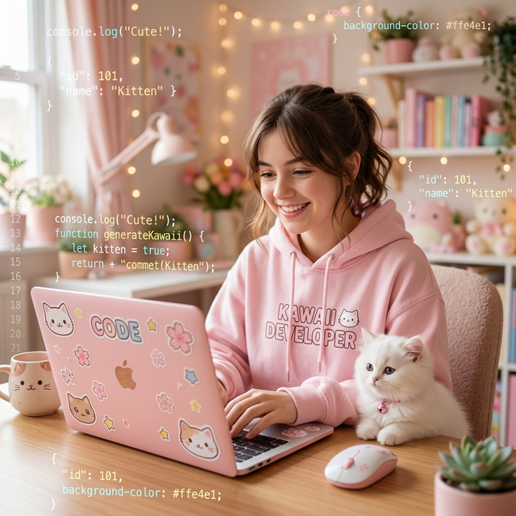
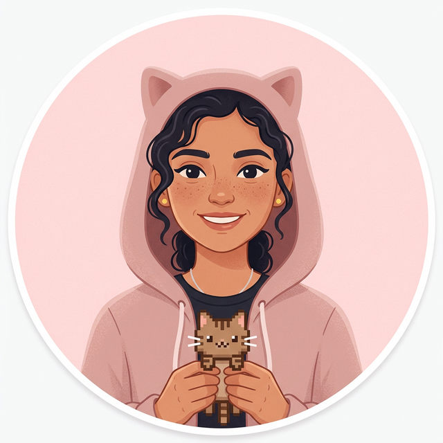
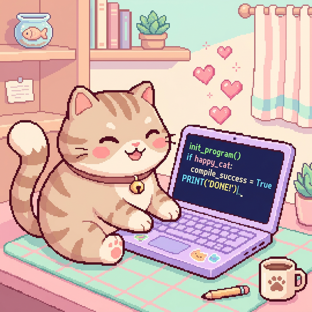
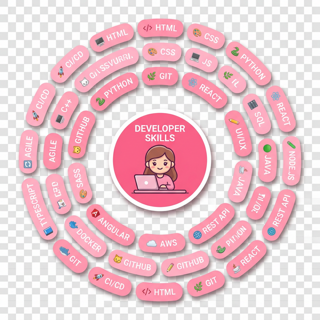
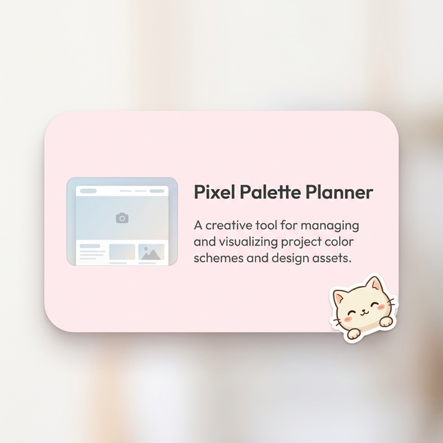
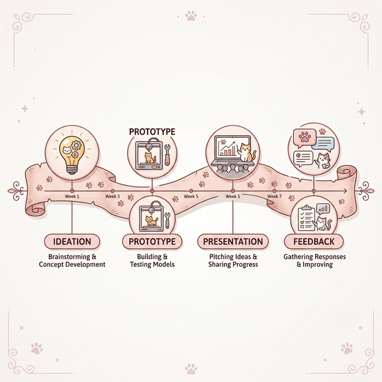
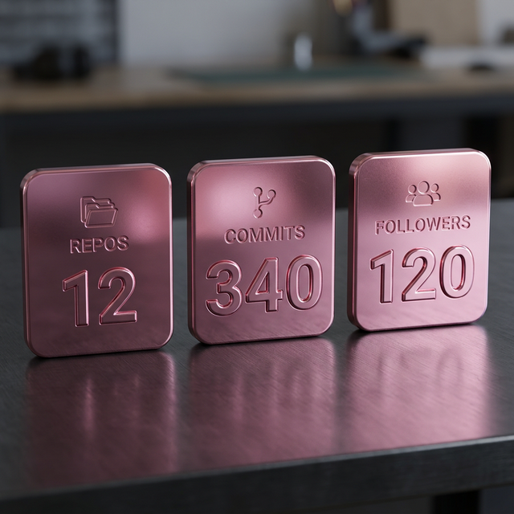
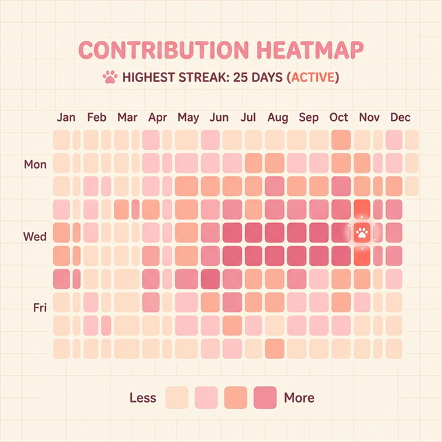
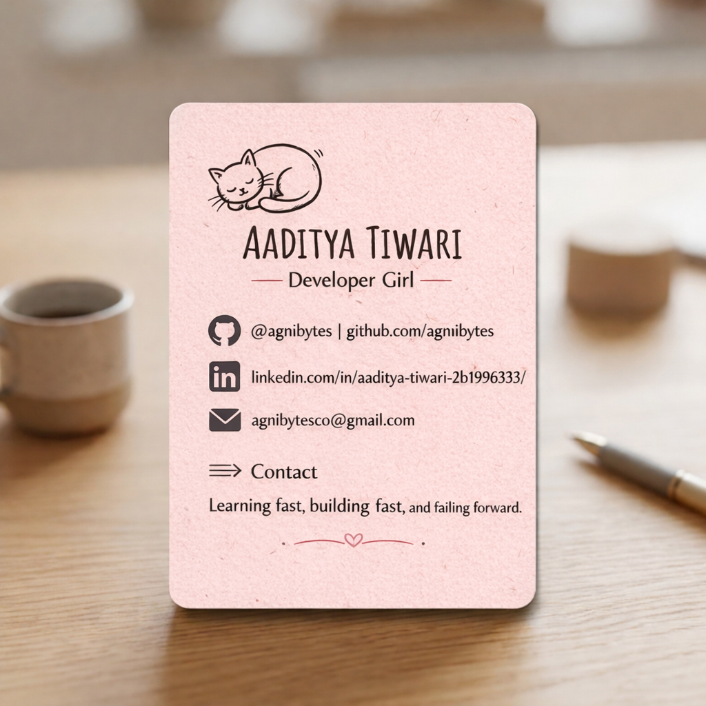
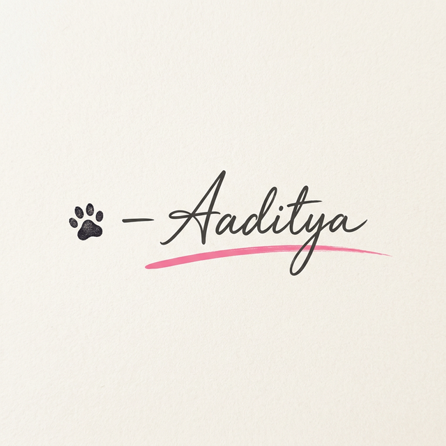

# 👩💻 Aaditya Tiwari — Developer Girl
*B.Tech CSE | 2nd Year | Team Agnibytes at KDKCE Nagpur*  
🚀 Curious. Creative. Code-driven. Building skills one bug, one build, and one bold idea at a time.

---

## 🌸 About Me
Hi, I’m **Aaditya Tiwari** — a passionate **developer girl** currently pursuing my B.Tech Engineering in Nagpur.  
I love learning by doing, breaking things (politely), fixing them, and turning small ideas into real projects. I strongly believe in: **learning fast, building fast, and failing forward.**

✨ **My Developer Girl Energy:**  
Creative mind | Technical curiosity | Strong learning mindset | Hungry to build real things

 

---

*When the build passes and the cat approves 🐱💗*

---

  
### 🔧 What I Work With

---

## 💼 Projects & Experience

  

**Team Agnibytes Projects**  
*Building scalable frontends and learning robust system design. It was intense, chaotic, and completely changed how I see development.*

---

### ⚡ Journey & Hackathons

*My first hackathon was with Team Agnibytes at Government Polytechnic College. A real taste of teamwork under pressure!*

---

### 📊 GitHub Stats & Streaks

 

*Little paw marks my best streaks 🐾*

---

### ✉️ Let's Connect!

I'm always open to collabs, hackathons & friendly coding chats.

  

Find me on [LinkedIn Profile](https://www.linkedin.com/in/aaditya-tiwari-2b1996333/) | [GitHub](https://github.com/USERNAME)

---

> **Build. Break. Learn. Repeat.**

