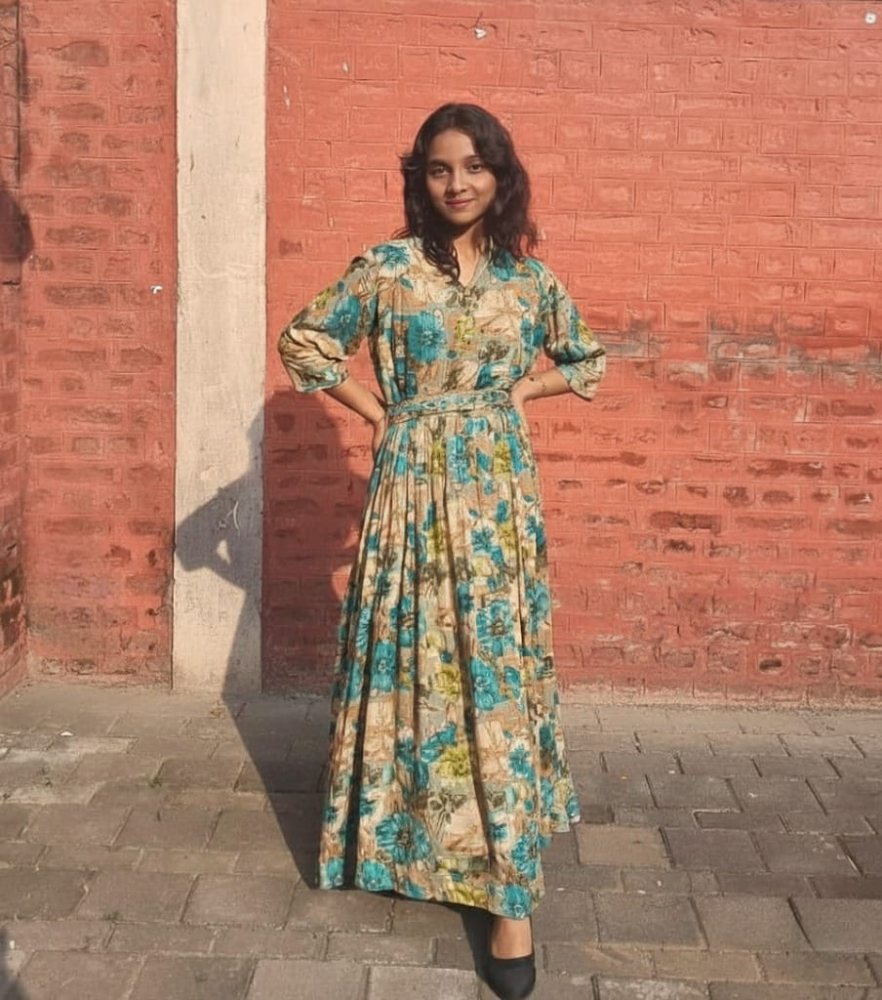

<div align="center">
  
</div>

<p align="center">
  
</p>

# 👩‍💻 Aaditya Tiwari — Developer Girl

<p align="left">
  
</p>

*🚀 Curious. Creative. Code-driven. Building skills one bug, one build, and one bold idea at a time.*

## 🌐 Connect with me

<p>
<a href="https://www.linkedin.com/in/aaditya-tiwari-2b1996333/">

</a>
</p>
<p align="left">
  <a href="https://www.linkedin.com/in/aaditya-tiwari-2b1996333/">
    
  </a>
  <a href="https://github.com/agnibytes">
    
  </a>
</p>

<p align="left">
  
</p>

---

<br>

## 🌸 About Me


Hi, I'm **Aaditya Tiwari** — a passionate **developer girl** currently pursuing my B.Tech Engineering in Nagpur.

I love learning by doing, breaking things (politely), fixing them, and turning small ideas into real projects.
I strongly believe in: **learning fast, building fast, and failing forward.**

✨ **My Developer Girl Energy:**
Creative mind | Technical curiosity | Strong learning mindset | Hungry to build real things

```yaml
name: "Aaditya Tiwari"
role: "Core Developer @ Team Agnibytes"
education: "B.Tech CSE, 2nd Year @ KDKCE Nagpur"
focus: ["Scalable Web Architectures", "Advanced System Design"]
```

<br clear="both"/>

<p align="center">
  
  <br>
  <em>When the build passes and the cat approves 🐱💗</em>
</p>

---

<br>

## 💻 Tech Stack & Tools

### 🔧 What I Work With

<p align="center">
  
</p>

**Interactive Badges:**

<p align="left">
  
  
  
  
</p>

<p align="left">
  
  
  
  
</p>

---

<br>

## 🚀 Projects & Experience

### 🔥 Team Agnibytes Projects

*Building scalable frontends and learning robust system design. It was intense, chaotic, and completely changed how I see development.*

<p align="center">
  
</p>

---

<br>

## ⚡ Journey & Hackathon Experience

*My first hackathon was with Team Agnibytes at Government Polytechnic College.*

<p align="center">
  
</p>

---

<br>

## 📊 Analytics & Impact

<p align="center">
  
</p>

<p align="center">
  
  <br>
  <em>Little paw marks my best streaks 🐾</em>
</p>

---

<br>

## 📈 Live GitHub Activity

### Overall Stats & Top Languages

<p align="center">
  
  
</p>

### Contribution Streak

<p align="center">
  
</p>

### Activity Graph

<p align="center">
  
</p>

## 🐍 Contribution Snake

<p align="center">
  
</p>

---

<br>

## ✉️ Let's Connect!

I'm always open to collabs, hackathons & friendly coding chats.

<p align="center">
  <a href="https://github.com/agnibytes">
    
  </a>
</p>

<br>

Find me on
[LinkedIn Profile](https://www.linkedin.com/in/aaditya-tiwari-2b1996333/) | [GitHub](https://github.com/agnibytes)

---

<br>

<div align="center">

## 💭 Thoughts of the Day

<p align="center">
  
</p>

<br><br>


<br>

> **Build. Break. Learn. Repeat.**

</div>

<p align="center">
  
</p>
