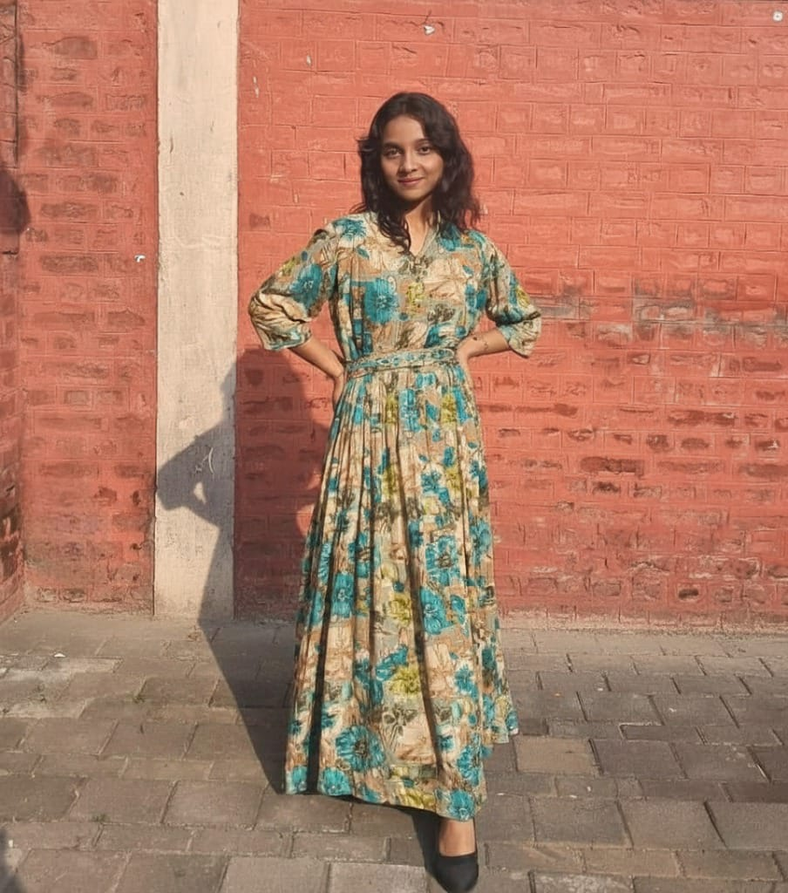

  <!-- Hero banner with a gradient animation -->
  

  

# 👩‍💻 Aaditya Tiwari — Developer Girl

  

*🚀 Curious. Creative. Code‑driven. Building skills one bug, one build, and one bold idea at a time.*

---

## 🌐 Portfolio

  

---

## 📫 Connect with Me

  
  
  

---

## 🛠️ Tech Stack

| Front‑End | Back‑End | DevOps | Design |
|:----------|:---------|:-------|:-------|
| ⚛️ React | 🌐 Node.js | 🚀 Vercel | 🎨 Figma |
| 📚 TypeScript | 🐍 Python | 🐙 GitHub Actions | 🖌️ CSS / Tailwind |
| 🌿 Next.js | ☁️ Firebase | 📦 npm | 📸 WebP Images |
| 🎨 Chakra UI | 📊 MongoDB | 🔧 Docker | 🖼️ SVG Icons |

---

## 📂 Projects & Highlights

<table>
  <tr>
    <td align="center"><strong>💡  Portfolio Site</strong></td>
    <td align="center"><strong>🚀  Hackathon Winner</strong></td>
    <td align="center"><strong>🧩  Open‑Source Contributions</strong></td>
  </tr>
  <tr>
    <td align="center">
      
    </td>
    <td align="center">
      
    </td>
    <td align="center">
      
    </td>
  </tr>
</table>

---

## 🏆 Achievements

- **Student Parliament Runner‑Up** – Recognized for leadership and community impact.  
- **Buzzer Quiz 2nd Prize** – Fast‑thinking under pressure.  
- **Hackathon Code** – Built a full‑stack solution in 24 hrs that won the top prize.

---

## 📈 GitHub Stats

  
   
  

---

## 🧑‍💻 Current Focus

- **Deepening** expertise in **system design** and **micro‑frontend architecture**.  
- **Contributing** to accessibility‑focused open‑source UI libraries.  
- **Experimenting** with **WebGL‑based visualisations** for interactive portfolios.

---

## 📚 Learning Roadmap

| Quarter | Goal | Resources |
|:-------:|------|-----------|
| Q3 2024 | Master **Next.js 14** & **React Server Components** | Official docs, egghead.io |
| Q4 2024 | Build a **Progressive Web App** for offline portfolio | PWAs.dev, Vercel examples |
| Q1 2025 | Contribute to **TypeScript 4.x** core | GitHub issues, TypeScript handbook |
| Q2 2025 | Publish a **design system** on npm | Storybook, Chakra UI |

---

## ✍️ Quote I Live By

> *“Code is not just a language; it’s a conversation between the mind and the machine.”* – **Aaditya**

---

  Made with ❤️, ☕, and a lot of **WebP**‑powered images.

